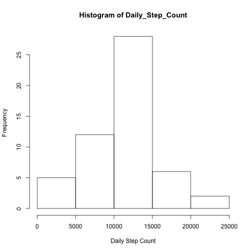
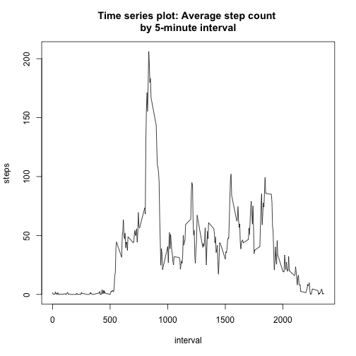
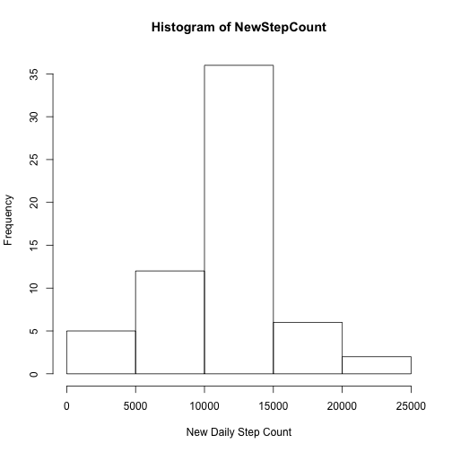
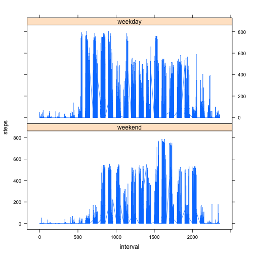

## Loading and preprocessing the data
  
  ```r
  data <- read.csv("activity.csv", na.strings = "NA", 
  stringsAsFactors = default.stringsAsFactors())
  head(data)
  ```
  
  ```
  ##   steps       date interval
  ## 1    NA 2012-10-01        0
  ## 2    NA 2012-10-01        5
  ## 3    NA 2012-10-01       10
  ## 4    NA 2012-10-01       15
  ## 5    NA 2012-10-01       20
  ## 6    NA 2012-10-01       25
  ```


## What is mean total number of steps taken per day?
  The following code creates a histogram of steps taken per day:   
  
  ```r
  Daily_Step_Count<-tapply(data$steps, data$date, FUN=sum)
  hist(Daily_Step_Count, xlab="Daily Step Count", ylab="Frequency")
  ```
  
   
  
  The following code calculates and prints the mean and median 
  steps taken per day:  
  
  ```r
  mean_steps <- mean(Daily_Step_Count, na.rm=TRUE)
  median_steps <- median(Daily_Step_Count,na.rm=TRUE)
  cat("mean daily step count = ", mean_steps, " median daily step count =", median_steps)
  ```
  
  ```
  ## mean daily step count =  10766.19  median daily step count = 10765
  ```

## What is the average daily activity pattern?
  The following code creates a time series plot of the average number of steps taken:  
  
  ```r
  Interval_step_count <- aggregate(steps ~ interval, data, mean)
  plot(Interval_step_count, type="l" )
  title(main = "Time series plot: Average step count \nby 5-minute interval")
  ```
  
   
  
  The following code calculates and prints The 5-minute interval that, on average, contains the maximum number of steps:  
  
  ```r
  row<-which.max(Interval_step_count[,2]) #row with highest ave step count
  maxInt <- Interval_step_count[row,1]
  cat("The 5-minute interval that, on average, contains the maximum number of steps is ", maxInt)
  ```
  
  ```
  ## The 5-minute interval that, on average, contains the maximum number of steps is  835
  ```

## Imputing missing values
  The following code calculates and reports the total number of missing values in the dataset (i.e. the total number of rows with 𝙽𝙰s):  
  
  ```r
  NAs<-sum(is.na(data$steps))
  cat("Total number of missing values is",NAs)
  ```
  
  ```
  ## Total number of missing values is 2304
  ```
  
  The following code creates a new dataset that is equal to the original dataset,
  but with the missing data filled in. The new dataset has NAs replaced with the 
  average step count for the 5 minute interval:  
  
  ```r
  new_df <- merge(Interval_step_count, data, by = "interval")
  colnames(new_df) <- c("interval", "aveSteps", "steps", "date ")
  new_df$steps[is.na(new_df$steps)] <- new_df$aveSteps[is.na(new_df$steps)]
  head(new_df)
  ```
  
  ```
  ##   interval aveSteps    steps      date 
  ## 1        0 1.716981 1.716981 2012-10-01
  ## 2        0 1.716981 0.000000 2012-11-23
  ## 3        0 1.716981 0.000000 2012-10-28
  ## 4        0 1.716981 0.000000 2012-11-06
  ## 5        0 1.716981 0.000000 2012-11-24
  ## 6        0 1.716981 0.000000 2012-11-15
  ```
  
  The following code creates a histogram of the total number of steps taken each day after missing values are imputed:  
  
  ```r
  NewStepCount<-tapply(new_df$steps, new_df$date, FUN=sum)
  hist(NewStepCount, xlab="New Daily Step Count", ylab="Frequency")
  ```
  
   
  
  The following code shows the changes to the daily step count mean and median after imputing NAs:  
  
  ```r
  newMean <- mean(NewStepCount)
  newMedian <- median(NewStepCount)
  means<-c(mean_steps,newMean)
  medians<-c(median_steps,newMedian)
  changes <- data.frame(means,medians, row.names=c("Before imputing NAs","After imputing NAs"))
  print(changes)
  ```
  
  ```
  ##                        means  medians
  ## Before imputing NAs 10766.19 10765.00
  ## After imputing NAs  10766.19 10766.19
  ```

## Are there differences in activity patterns between weekdays and weekends?
  The following code creates a panel plot comparing the average number of steps taken per 5-minute interval across weekdays and weekends:  
  
  ```r
  library(lattice)
  weekdays1 <- c("Monday","Tuesday","Wednesday","Thursday","Friday")
  new_df$day <- factor((weekdays(as.Date(new_df$date)) %in% weekdays1), 
                     levels=c(FALSE, TRUE), labels=c('weekend', 'weekday'))
  xyplot(steps~interval|day, data=new_df, layout=c(1,2), type="l")
  ```
  
   

